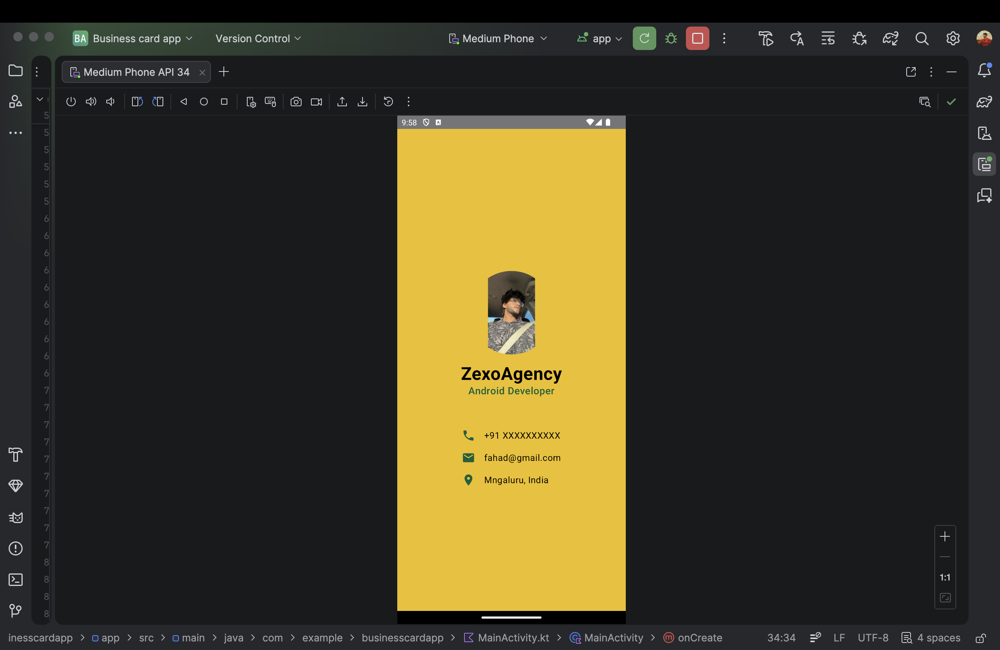

# 📇 Business Card App – Jetpack Compose

A simple and clean Business Card Android application built using **Kotlin** and **Jetpack Compose**.

This app displays a developer profile with image, name, role, and contact information using modern Compose UI principles.

---

## 🚀 Features

- Profile image with circular clipping
- Name & professional title
- Phone number, email, and location
- Clean centered layout using `Column`
- Material 3 theme support
- Fully built using Jetpack Compose

---

## 🛠 Tech Stack

- **Kotlin**
- **Jetpack Compose**
- **Material 3**
- **Android Studio**
- **MVVM-ready structure**

---

## 📱 UI Preview

> Business card layout with centered profile image and contact details.
> ## 📱 UI Preview

---

## 📂 Project Structure---

## 🎯 Learning Outcomes

This project helped me understand:

- Composable functions
- Layouts (`Column`, `Row`, `Modifier`)
- State management basics
- Image resources & clipping
- Clean UI design with Compose

---

## 👨‍💻 Author

**Fahad Umar Farooq**  
Android Developer (Learning & Building 🚀)

---

## ⭐ Future Improvements

- Add dark mode support
- Add clickable phone/email actions
- Improve responsiveness for tablets
- Add animations

---

### 🔥 Built as part of Android Compose learning journey.
